<div align="center">
  
  <h1>CreBot - AI Customer Support Chatbot Builder</h1>
  
  <p>A self-serve SaaS platform that empowers businesses to create, train, and embed ultra-fast AI customer support chatbots in minutes. Powered by Groq's high-speed inference and Local Vector Embeddings.</p>

  <p>
    <strong>Live Demos:</strong><br/>
    <a href="https://chatwithcrebot.netlify.app">chatwithcrebot.netlify.app</a> &nbsp;|&nbsp; 
    <a href="https://crebot.pages.dev">crebot.pages.dev</a>
  </p>

  <div>
    
    
    
    
    
  </div>
</div>

<hr/>

## ✨ Key Features

* **⚡ Blazing Fast Responses:** Utilizes Groq's GPT models (`openai/gpt-oss-120b`) for near-instant answer generation.
* **🧠 Context-Aware Retrieval:** Intelligent RAG (Retrieval-Augmented Generation) pipeline using local sentence-transformers and `pgvector` for accurate FAQ searching.
* **🌐 Universal Embed Widget:** Lightweight, vanilla JavaScript widget that can be embedded on *any* HTML/JS website with a single `<script>` tag.
* **🔐 Secure Authentication:** Seamless user onboarding, profile management, and workspace security powered by **Clerk**.
* **📊 Dashboard Analytics:** Track queries, view chat logs, and monitor bot usage directly from a sleek dark-mode React dashboard.
* **🔑 Bring Your Own Key (BYOK):** Users can provide their own Groq API keys to bypass default rate limits (7 requests/minute).

---

## 🛠️ Tech Stack

### Frontend Architecture
* **Framework:** React 18 with Vite
* **Language:** TypeScript
* **Styling:** Tailwind CSS & Framer Motion (Micro-animations)
* **Authentication:** Clerk
* **Visuals & Charts:** Recharts & React Three Fiber (3D Elements)

### Backend Architecture
* **Framework:** FastAPI (Python)
* **Database:** Supabase (PostgreSQL)
* **Vector Store:** `pgvector` extension for Supabase
* **Embedding Model:** Local `sentence-transformers/all-MiniLM-L6-v2`
* **LLM Provider:** Groq (`openai/gpt-oss-120b`)
* **Rate Limiting:** In-memory sliding window algorithm

---

## 🔄 System Architecture & Data Flow

### Backend Architecture Diagram

<p align="center">
  
</p>

### Sequence Diagram

Below is the complete sequence of how data flows through the CreBot system, from Bot Creation to answering an End-User's query.

```mermaid
sequenceDiagram
    autonumber
    
    actor Admin as Business Owner
    participant Dash as React Dashboard
    participant API as FastAPI Backend
    participant Embed as Local Embeddings
    participant DB as Supabase (pgvector)
    
    actor User as Website Visitor
    participant Widget as Embedded JS Widget
    participant LLM as Groq LLM API
    
    %% Bot Training Flow
    rect rgb(20, 20, 20)
    Note over Admin, DB: Phase 1: Bot Training
    Admin->>Dash: Uploads FAQ / Knowledge Base
    Dash->>API: POST /api/bots/{id}/train (FAQ Text)
    API->>API: Chunk text into paragraphs
    API->>Embed: Generate 384-dim vectors for chunks
    Embed-->>API: Vector arrays
    API->>DB: Store text chunks + vectors
    DB-->>API: Success
    API-->>Dash: Training Complete
    end
    
    %% Chat Flow
    rect rgb(30, 20, 20)
    Note over User, LLM: Phase 2: User Chat
    User->>Widget: "What is your refund policy?"
    Widget->>API: POST /api/widget/{key}/chat (Query + History)
    
    API->>API: Rate Limit Check (7 req/min per bot)
    
    API->>LLM: Reformulate vague query (using history)
    LLM-->>API: Standalone Query
    
    API->>Embed: Vectorize Standalone Query
    Embed-->>API: Query Vector
    
    API->>DB: pgvector Similarity Search (Top 5 chunks)
    DB-->>API: Most relevant FAQ chunks
    
    API->>LLM: Generate final answer based ONLY on chunks
    LLM-->>API: "Our refund policy is 30 days..."
    
    API->>DB: Log Query & Answer (Analytics)
    
    API-->>Widget: JSON Response
    Widget-->>User: Displays Answer UI
    end
```



---

## 📁 Project Structure

```text
CreBot/
├── schema.sql                    # Essential Supabase PostgreSQL schema
├── backend/
│   ├── main.py                   # FastAPI Application Entry
│   ├── config.py                 # Environment configurations
│   ├── routes/                   # API Endpoints (bots, chat, widget, auth)
│   ├── services/                 # Core Logic (retrieval, rate_limiter, groq)
│   ├── utils/                    # Supabase Client & Clerk Auth Helpers
│   └── requirements.txt          # Python Dependencies
├── frontend/
│   ├── src/
│   │   ├── components/           # Reusable React UI Components
│   │   ├── pages/                # Dashboard, Profile, Billing views
│   │   ├── services/             # API client services
│   │   └── App.tsx               # React Router configuration
│   ├── package.json              # Node Dependencies
│   └── tailwind.config.js        # UI Styling Rules
└── widget/
    └── crebot-widget.js          # The deployable vanilla JS script
```

---

## 🚀 Quick Start Guide

### 1. Database Setup (Supabase)
1. Create a free project at [supabase.com](https://supabase.com).
2. Navigate to **Database → Extensions** and enable `vector` (pgvector).
3. Open the **SQL Editor**, paste the contents of `schema_*.sql` and run it to configure tables, Row Level Security (RLS), and search functions.

### 2. Backend Setup
```bash
cd backend

# Create and activate virtual environment
python -m venv venv
venv\Scripts\activate        # Windows
# source venv/bin/activate   # macOS/Linux

# Install dependencies
pip install -r requirements.txt

# Configure environment variables
# Copy .env.example to .env and fill in:
# SUPABASE_URL, SUPABASE_SERVICE_KEY, GROQ_API_KEY, CLERK_FRONTEND_API
copy .env.example .env

# Run the API server
uvicorn main:app --reload --port 8000
```

### 3. Frontend Setup
```bash
cd frontend

# Install Node dependencies
npm install

# Start the Vite development server
npm run dev
```

### 4. Test Your Chatbot Widget
Embed the following code into the `<body>` of any HTML file to test your trained chatbot:

```html
<script
  src="http://localhost:3000/widget/crebot-widget.js"
  data-widget-key="YOUR_BOT_WIDGET_KEY"
  data-api-url="http://localhost:8000"
  async>
</script>
```

---

## 🛡️ Security & Rate Limiting

To ensure platform stability, CreBot enforces a strict **Rate Limit of 10 requests per minute per bot** on the public widget endpoints when utilizing the shared platform Groq API Key. 

Users who wish to scale beyond this can navigate to the **Own API** settings in the dashboard and securely input their own Groq API Key. Doing so automatically disables the platform rate limits and routes their bot's traffic directly through their private quota.

---

## 📄 License
MIT License. See `LICENSE` for more information.